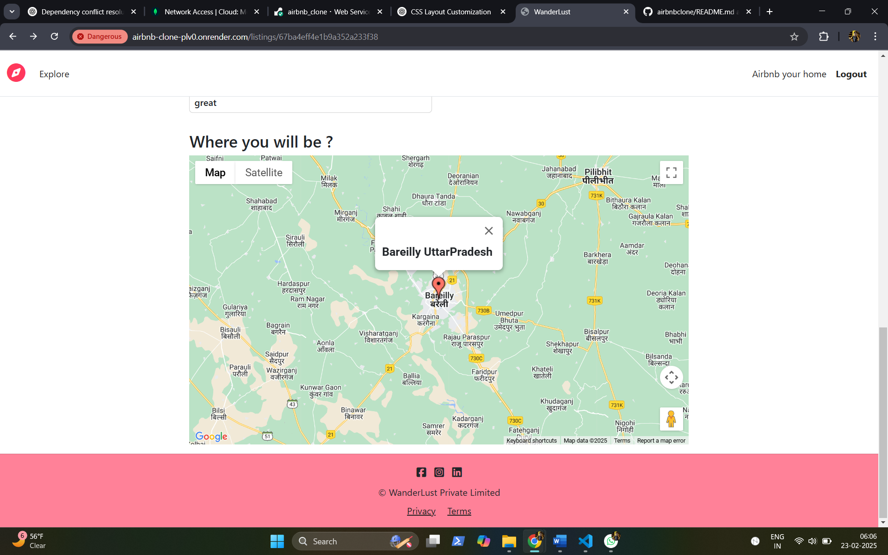
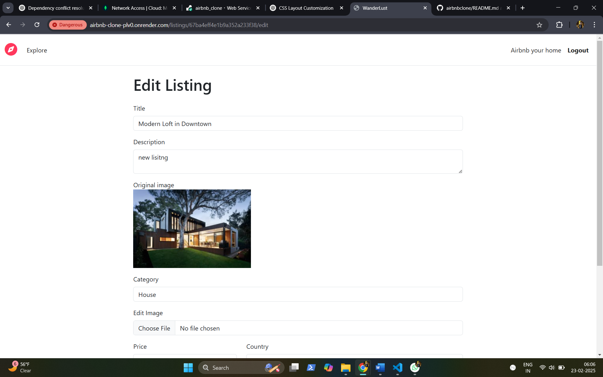
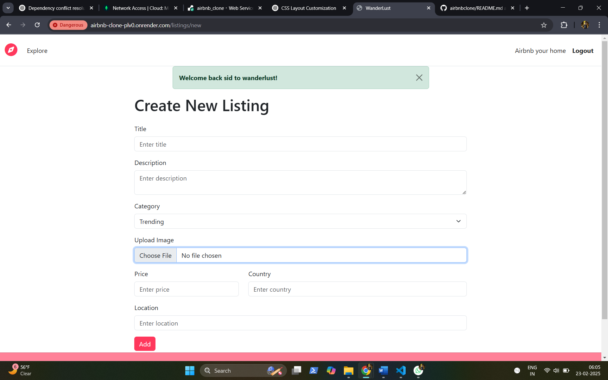
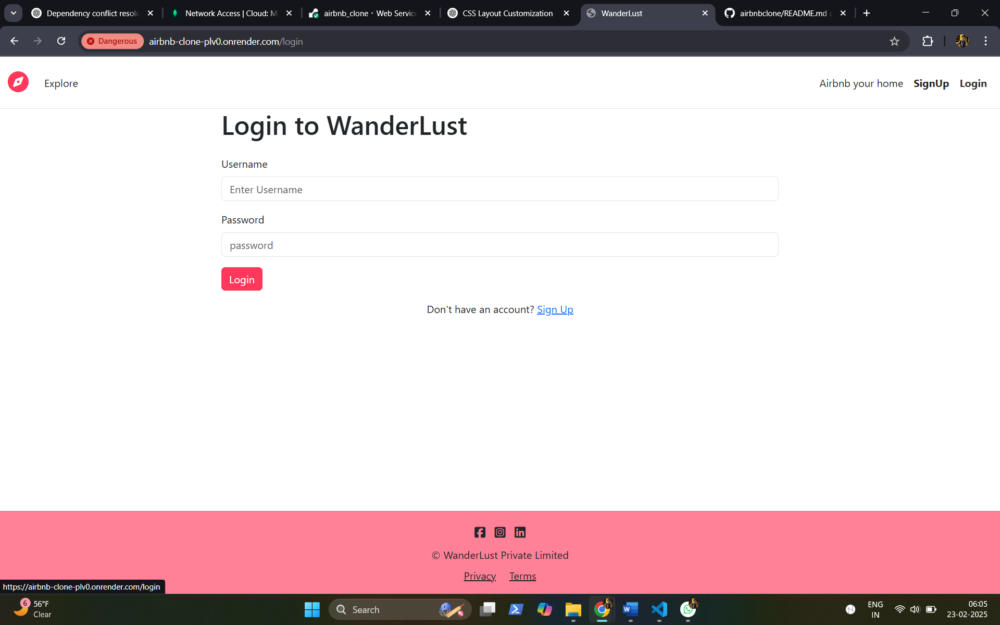
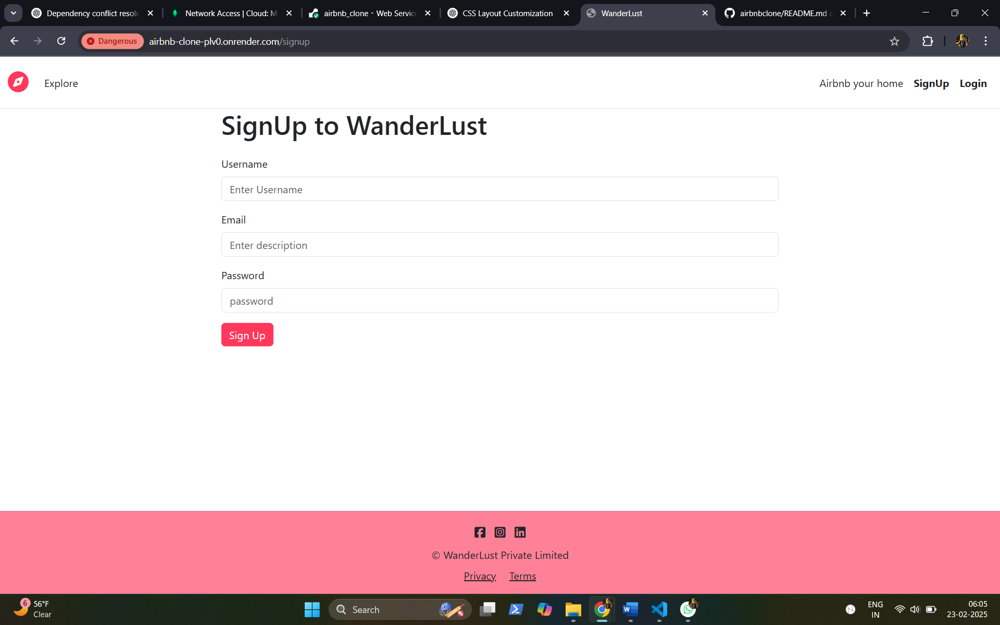
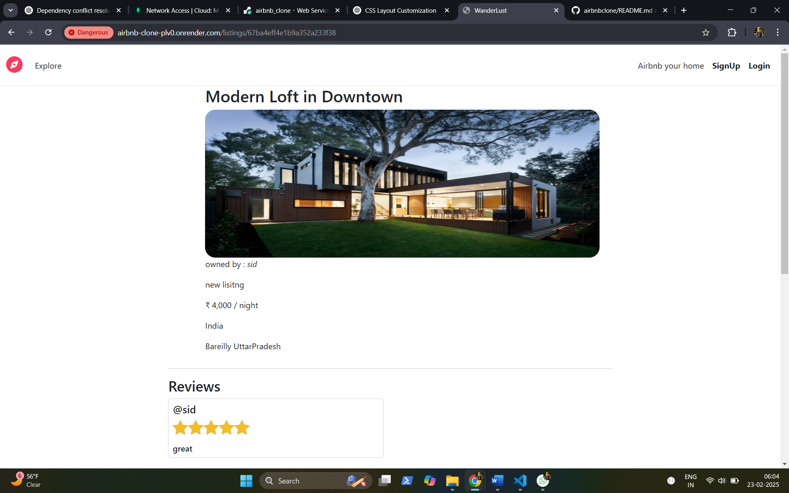
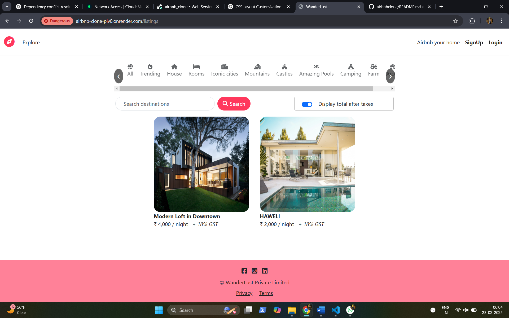

# Wanderlust

Wanderlust is a web application that allows users to explore and book unique accommodations, including houses, rooms, castles, and camping spots. The project integrates a free map API (google maps) and provides user authentication, reviews, and category-based filtering.

## 🚀 Features
- 🏠 **Browse Listings:** View various accommodations like houses, rooms, castles, and more.
- 🔍 **Search & Filters:** Search destinations and filter properties by categories (Trending, Mountains, Camping, etc.).
- 🗺 **Map Integration:** Displays property locations using Google Maps Api.
- 📝 **User Reviews:** Users can leave reviews and ratings.
- 🔐 **Authentication:** Secure login and signup using Passport.js.
- 🛒 **Tax Toggle:** Users can toggle to see the total price including taxes.

---

## 🛠️ Tech Stack
- **Backend:** Node.js, Express.js, Mongoose
- **Frontend:** HTML, CSS, JavaScript, EJS (Embedded JavaScript)
- **Authentication:** Passport.js (Local Strategy)
- **Session Management:** Express-session
- **Styling:** Bootstrap & Font Awesome
- **Deployment:** (To be decided - Render, Vercel)

---

## 🏗 Installation & Setup

### 1️⃣ Clone the repository
```sh
git clone https://github.com/your-username/wanderlust.git
cd wanderlust
```

### 2️⃣ Install dependencies
```sh
npm install
```

### 3️⃣ Setup environment variables
Create a `.env` file and add the following:
```env
CLOUD_NAME=your_cloudinary_name
CLOUD_API_KEY=your_cloudinary_api_key
CLOUD_API_SECRET=your_cloudinary_secret
MAP_API_KEY=your_google_maps_api_key
ATLASDB_URL=your_mongodb_connection_string
SECRET=your_secret_key
```
### 4️⃣ Initialize sample database  
Run the `initDB.js` script inside the `init/` folder to populate the database with sample listings.  

```sh
node init/initDB.js
```

### 5️⃣  Start the server
```sh
npm start
```
The app will run on `http://localhost:8080`

---

## 📂 Project Structure
```
airbnbclone/
│-- controllers/     # Controller functions for handling business logic
│-- init/            # Initialization scripts (DB connection, config, etc.)
│-- models/          # Mongoose schemas (User, Listing, Review)
│-- node_modules/    # Installed npm dependencies
│-- public/          # Static files (CSS, JS, Images)
│-- routes/          # Express route files (user, listings, reviews, etc.)
│-- screenshots/     # Screenshots for documentation or README
│-- utils/           # Helper functions (error handling, async wrappers)
│-- views/           # EJS templates (frontend views)
│-- .env             # Environment variables file
│-- .gitignore       # Git ignore file
│-- app.js           # Main application file
│-- cloudconfig.js   # Cloudinary or storage configurations
│-- middleware.js    # Middleware functions
│-- package.json     # Dependencies & scripts
│-- package-lock.json# Version lock file
│-- README.md        # Project documentation
│-- schema.js        # Additional database schema (if any)

```
---

## 📄 License
This project is licensed under the **MIT License**.

**Enjoy using Wanderlust! 🌍✈️**

## SCREENSHOTS
 
 
 
 
 
 
 
